# [inGitDB](https://ingitdb.com)

[](https://github.com/ingitdb/ingitdb-cli/actions/workflows/golangci.yml)
[](https://goreportcard.com/report/github.com/ingitdb/ingitdb-cli)
[](https://coveralls.io/github/ingitdb/ingitdb-cli?branch=main)
[](https://godoc.org/github.com/ingitdb/ingitdb-cli)
[](https://github.com/ingitdb/ingitdb-cli/tags)


[**in**Git**DB**](https://ingitdb.com) is a **developer-grade, schema-validated, AI-native database whose storage engine
is a
Git
repository**. Every record is a plain YAML or JSON file, every change is a commit, and every team
workflow — branching, code review, pull requests — extends naturally to data. This makes inGitDB
simultaneously a database, a version-control system, an event bus, and a data layer for AI agents,
all with zero server infrastructure for reads.

## 💡 Why inGitDB?

- **Plain files, real Git.** Records are YAML or JSON files you can read in any editor, diff in any
  pull request, and clone with a single `git clone`. No binary blobs, no proprietary format.
- **Full Git history for free.** Branching, merging, bisect, and revert work on your data exactly
  as they do on your code — because the data _is_ in your code repository.
- **Schema validation built in.** Collections are defined with typed column schemas in YAML. The
  `ingitdb validate` command checks every record and reports violations with the collection,
  file path, and field name.
- **Zero server infrastructure for reads.** There is no daemon to run. Reading data is a
  file-system operation on a git clone.
- **AI-native via MCP.** The planned MCP server (`ingitdb serve --mcp`) will expose CRUD operations
  to AI agents through the Model Context Protocol — no custom integration required (Phase 6).
- **Go library via DALgo.** `pkg/dalgo2ingitdb` implements the [DALgo](https://github.com/dal-go/dalgo)
  `dal.DB` interface, so any Go program can use inGitDB as a standard database abstraction.

## ⚙️ How it works

```mermaid
flowchart LR
    A([YAML / JSON\nrecord files]) --> B[(Git repository\non disk)]
    B --> C[ingitdb validate\nschema + data check]
    C --> D[Views Builder\ngenerates $views/]
    D --> E([CLI output\ningitdb query])
    D --> F([Go programs\nDALgo API])
    D --> G([AI agents\nMCP server — Phase 6])
```



The `ingitdb validate` command reads `.ingitdb.yaml`, checks every record against its collection
schema, and rebuilds materialized views in the same pass. Validation can be scoped to a commit
range (`--from-commit` / `--to-commit`) so CI stays fast on large databases.

## ⬇️ Installation

```shell
# From source
go install github.com/ingitdb/ingitdb-cli/cmd/ingitdb

# Mac OS
brew tap ingitdb/cli
brew install ingitdb
```

## 🚀 Quick start

```shell
# Build the CLI
go build -o ingitdb ./cmd/ingitdb

# Validate a database directory (defaults to current working directory)
ingitdb validate

# Validate a specific path
ingitdb validate --path=/path/to/your/db

# Validate only records changed between two commits (fast CI mode)
ingitdb validate --from-commit=abc1234 --to-commit=def5678

# List all collections
ingitdb list collections

# List collections nested under a path (regular expression)
ingitdb list collections --in='countries/(ie|gb)'

# List collections whose name contains "city"
ingitdb list collections --filter-name='*city*'

# Search records for a substring across all fields
ingitdb find --substr=Dublin

# Search records using a regular expression, limited to 10 results
ingitdb find --re='pop.*[0-9]{6,}' --limit=10

# Search only specific fields
ingitdb find --substr=Dublin --fields=name,capital

# Scope a search to a sub-path
ingitdb find --exact=Ireland --in='countries/.*' --fields=country

# Delete all records from a collection (keeps the schema)
ingitdb truncate --collection=countries.counties

# Delete a specific collection and all its records
ingitdb delete collection --collection=countries.counties.dublin

# Delete records matching a pattern within a collection
ingitdb delete records --collection=countries.counties --filter-name='*old*'

# --- Record CRUD (requires record_file.type: "map[string]any" collections) ---

# Create a new record: the --id format is <collection-id>/<record-key>
# (collection IDs allow alphanumeric and "." only; "/" separates collection and key)
ingitdb create record --path=. --id=geo.nations/ie --data='{title: "Ireland"}'

# Read a record (output format: yaml or json)
ingitdb read record --path=. --id=geo.nations/ie
ingitdb read record --path=. --id=geo.nations/ie --format=json

# Update fields of an existing record (patch semantics: only listed fields change)
ingitdb update record --path=. --id=geo.nations/ie --set='{title: "Ireland, Republic of"}'

# Delete a single record
ingitdb delete record --path=. --id=geo.nations/ie
```

## 🔗 Accessing GitHub Repositories Directly

inGitDB can read and write records in a remote GitHub repository without cloning it. The
`--github` flag replaces `--path` and points the CLI at a GitHub repository over the REST API.

### Public repositories (no token required)

```shell
# Read a record
ingitdb read record --github=owner/repo --id=countries/ie

# Pin to a specific branch, tag, or commit SHA
ingitdb read record --github=owner/repo@main --id=todo.tags/active
ingitdb read record --github=owner/repo@v1.2.0 --id=todo.tags/active

# List all collections
ingitdb list collections --github=owner/repo
```

### Private repositories

Supply a token via the `GITHUB_TOKEN` environment variable or the `--token` flag. All write
operations also require a token, even for public repositories.

```shell
# Set the token once in your shell
export GITHUB_TOKEN=ghp_...

ingitdb read record --github=owner/repo --id=countries/ie
ingitdb list collections --github=owner/repo
ingitdb create record --github=owner/repo --id=countries/ie --data='{name: Ireland}'
ingitdb update record --github=owner/repo --id=countries/ie --set='{name: Ireland, capital: Dublin}'
ingitdb delete record --github=owner/repo --id=countries/ie

# Or pass the token inline (not recommended for scripts — it ends up in shell history)
ingitdb read record --github=owner/repo --token=ghp_... --id=countries/ie
```

Each write operation (`create record`, `update record`, `delete record`) creates a single commit
in the remote repository. No local clone is required at any point.

See [GitHub Direct Access](docs/features/github-direct-access.md) for the full reference,
including authentication details, rate limit notes, and limitations.

---

A minimal `.ingitdb.yaml` at the root of your DB git repository:

```yaml
rootCollections:
  tasks.backlog: data/tasks/backlog
  tasks.inprogress: data/tasks/in-progress
languages:
  - required: en
```

## 🛠️ Commands

| Command             | Status     | Description                                              |
|---------------------|:-----------|----------------------------------------------------------|
| `version`           | ✅ done     | Print build version, commit hash, and date               |
| `validate`          | ✅ done     | Check every record against its collection schema         |
| `read record`       | ✅ done     | Read a single record by ID (local or GitHub)             |
| `create record`     | ✅ done     | Create a new record in a collection                      |
| `update record`     | ✅ done     | Update fields of an existing record (local or GitHub)    |
| `delete record`     | ✅ done     | Delete a single record by ID (local or GitHub)           |
| `list collections`  | ✅ done     | List collection IDs (local or GitHub)                    |
| `list view`         | 🟡 planned | List view definition                                     |
| `list subscribers`  | 🟡 planned | List subscribers                                         |
| `find`              | 🟡 planned | Search records by substring, regex, or exact value       |
| `delete collection` | 🟡 planned | Remove a collection                                      |
| `delete view`       | 🟡 planned | Remove view definition                                   |
| `delete records`    | 🟡 planned | Remove records from a collection                         |
| `truncate`          | 🟡 planned | Remove all records from a collection, keeping its schema |
| `query`             | 🟡 planned | Query and format records from a collection               |
| `materialize`       | 🟡 planned | Build materialized views into `$views/`                  |
| `pull`              | 🟡 planned | Pull remote changes and rebuild views                    |
| `watch`             | 🟡 planned | Stream record change events to stdout                    |
| `serve`             | 🟡 planned | Start MCP, HTTP API, or file-watcher server              |
| `resolve`           | 🟡 planned | Interactive TUI for resolving data-file merge conflicts  |
| `setup`             | 🟡 planned | Initialise a new database directory                      |
| `migrate`           | 🟡 planned | Migrate records between schema versions                  |

### --id format

The `--id` flag uses `/` to separate collection ID from the record key:

```
<collection-id>/<record-key>
```

Collection IDs may contain only alphanumeric characters and `.` (e.g. `geo.nations`), and must start
and end with an alphanumeric character. Use `/` only after the collection ID (e.g. `--id=geo.nations/ie`).
The longest matching collection prefix wins when ambiguous.

Only collections with `record_file.type: "map[string]any"` support CRUD. Collections using
`[]map[string]any` (list) or `map[string]map[string]any` (dictionary) are not yet implemented.

See the [CLI reference](docs/CLI.md) for flags and examples.

## 📚 Documentation

| Document                                                      | Description                                                          |
|---------------------------------------------------------------|----------------------------------------------------------------------|
| [Documentation](docs/README.md)                               | Full docs index — start here                                         |
| [CLI reference](docs/CLI.md)                                  | Every subcommand, flag, and exit code                                |
| [Features](docs/features/README.md)                           | What inGitDB can do today and what is coming                         |
| [GitHub Direct Access](docs/features/github-direct-access.md) | Read and write records in remote GitHub repositories without cloning |
| [Architecture](docs/ARCHITECTURE.md)                          | Data model, package map, and key design decisions                    |
| [Roadmap](docs/ROADMAP.md)                                    | Nine delivery phases from Validator to GraphQL                       |
| [Contributing](docs/CONTRIBUTING.md)                          | How to open issues and submit pull requests                          |
| [Competitors](docs/COMPETITORS.md)                            | Honest feature comparison with related tools                         |

## 🤝 Get involved

inGitDB is small enough that every contribution makes a visible difference. The best way to start
is to point the CLI at a directory of YAML files and run `ingitdb validate`, then check the
[Roadmap](docs/ROADMAP.md) to see what is being built next.

To contribute:

1. Read [CONTRIBUTING.md](docs/CONTRIBUTING.md) for the pull-request workflow.
2. Browse [open issues](https://github.com/ingitdb/ingitdb-cli/issues) to find something to work on.
3. Open or comment on an issue before investing time in a large change.

Bug reports, documentation improvements, and questions are all welcome.

## 📦 Dependencies

- [DALgo](https://github.com/dal-go/dalgo) — Database Abstraction Layer for Go

## 📄 License

This project is free, open source and licensed under the MIT License. See the [LICENSE](LICENSE)
file for details.
