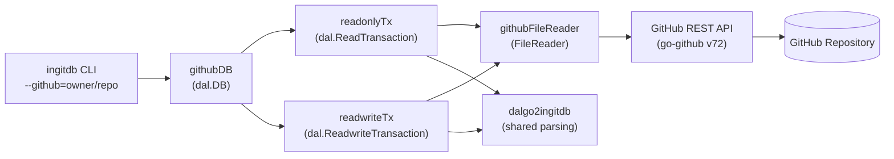

# dalgo2ghingitdb — GitHub DALgo Adapter

## Overview

`pkg/dalgo2ghingitdb` is a [DALgo](https://github.com/dal-go/dalgo) database adapter that
provides full CRUD access to inGitDB repositories stored on GitHub. It uses the GitHub REST API
to read and write files directly, with no local clone required.

The package is consumed by the `ingitdb` CLI when `--github=owner/repo` is supplied, and can
also be used as a Go library by any program that needs database access to a remote inGitDB
repository.

## Features

- Read-only access to public repositories (no token required)
- Authenticated reads and writes for public and private repositories
- Support for `SingleRecord` and `MapOfIDRecords` record types
- YAML and JSON record formats
- Locale-aware field transformations (read and write paths)
- Every write creates a single commit with a descriptive message
- Token supplied via `Config.Token` field or `GITHUB_TOKEN` environment variable (CLI only)
- Comprehensive error handling: rate limits, 404s, forbidden, and other API errors

## Architecture



### Package structure

| File | Responsibility |
|---|---|
| `file_reader.go` | `Config`, `FileReader` interface, `githubFileReader` implementation |
| `db_github.go` | `githubDB` — implements `dal.DB`; routes transactions |
| `tx_readonly.go` | `readonlyTx` — implements `dal.ReadTransaction` |
| `tx_readwrite.go` | `readwriteTx` — implements `dal.ReadwriteTransaction` |
| `record_content.go` | `resolveRecordPath` — maps collection + key to a file path |
| `constants.go` | Package-level constants (e.g. `DatabaseID`) |

### Shared parsing — `pkg/dalgo2ingitdb`

Both the local adapter (`dalgo2ingitdb`) and this package share record parsing and locale logic
from `pkg/dalgo2ingitdb`:

- `dalgo2ingitdb.ParseRecordContent(content, format)` — decode a single-record YAML/JSON file.
- `dalgo2ingitdb.ParseMapOfIDRecordsContent(content, format)` — decode a map-of-records file.
- `dalgo2ingitdb.ApplyLocaleToRead(data, columns)` — flatten locale fields for reading.
- `dalgo2ingitdb.ApplyLocaleToWrite(data, columns)` — expand locale fields before writing.

This ensures identical record semantics whether data comes from disk or from GitHub.

---

## Components

### `Config`

```go
type Config struct {
    Owner      string       // GitHub organisation or user name (required)
    Repo       string       // Repository name (required)
    Ref        string       // Branch, tag, or commit SHA (optional; defaults to repo default branch)
    Token      string       // Personal access token or GitHub App token (optional for public reads)
    APIBaseURL string       // Custom API endpoint; used for GitHub Enterprise (optional)
    HTTPClient *http.Client // Custom HTTP client; useful for testing (optional)
}
```

- `Token` is the primary mechanism for authenticated access. When empty, requests are sent
  unauthenticated (60 req/h rate limit on the public API).
- `APIBaseURL` overrides `https://api.github.com/` — needed only for GitHub Enterprise Server
  installations.

### `FileReader` interface

```go
type FileReader interface {
    ReadFile(ctx context.Context, path string) (content []byte, found bool, err error)
    ListDirectory(ctx context.Context, dirPath string) (entries []string, err error)
}
```

`ReadFile` fetches a single file by path and returns its decoded contents. Returns
`found = false` (no error) when the file does not exist (HTTP 404).

`ListDirectory` lists the names of all entries inside a directory path. Returns an empty slice
(no error) when the directory does not exist.

`NewGitHubFileReader(cfg Config) (FileReader, error)` is the public constructor.

### `githubDB`

Implements `dal.DB`. Constructors:

```go
// Basic constructor — most operations require a definition, so prefer the variant below.
func NewGitHubDB(cfg Config) (dal.DB, error)

// Recommended: supply the pre-loaded schema definition.
func NewGitHubDBWithDef(cfg Config, def *ingitdb.Definition) (dal.DB, error)
```

Supported `dal.DB` methods:

| Method | Support |
|---|---|
| `RunReadonlyTransaction` | Full |
| `RunReadwriteTransaction` | Full |
| `Get` | Full (convenience wrapper around `RunReadonlyTransaction`) |
| `Exists` | Not implemented |
| `GetMulti` | Not implemented |
| `ExecuteQueryToRecordsReader` | Not implemented |
| `ExecuteQueryToRecordsetReader` | Not implemented |

### `readonlyTx`

Implements `dal.ReadTransaction`. Supports:

- `Get(ctx, record)` — fetches a single record by key. Supports `SingleRecord` and
  `MapOfIDRecords` collection types.

### `readwriteTx`

Implements `dal.ReadwriteTransaction`. Extends `readonlyTx` and adds:

| Method | Behaviour |
|---|---|
| `Insert(ctx, record)` | Writes a new record file (or adds a key to a map file). Returns an error if the record already exists. Creates one commit. |
| `Set(ctx, record)` | Overwrites an existing record (or upserts into a map file). Creates one commit. |
| `Delete(ctx, key)` | Removes a record file (or deletes a key from a map file). Returns `dal.ErrRecordNotFound` if the record does not exist. Creates one commit. |
| `SetMulti` | Not implemented |
| `DeleteMulti` | Not implemented |
| `Update` | Not implemented |
| `UpdateRecord` | Not implemented |
| `UpdateMulti` | Not implemented |
| `InsertMulti` | Not implemented |

**Commit messages** are generated automatically in the format:

```
ingitdb: <insert|set|delete> <collectionID>/<recordKey>
```

---

## Usage example

```go
package main

import (
    "context"
    "fmt"

    "github.com/dal-go/dalgo/dal"
    "github.com/ingitdb/ingitdb-cli/pkg/dalgo2ghingitdb"
    "github.com/ingitdb/ingitdb-cli/pkg/ingitdb"
)

func main() {
    cfg := dalgo2ghingitdb.Config{
        Owner: "ingitdb",
        Repo:  "ingitdb-cli",
        Ref:   "main",
        // Token: os.Getenv("GITHUB_TOKEN"), // required for writes or private repos
    }

    def := &ingitdb.Definition{
        Collections: map[string]*ingitdb.CollectionDef{
            "todo.tags": {
                ID:      "todo.tags",
                DirPath: "test-ingitdb/todo/tags",
                RecordFile: &ingitdb.RecordFileDef{
                    Name:       "{key}.yaml",
                    Format:     "yaml",
                    RecordType: ingitdb.SingleRecord,
                },
            },
        },
    }

    db, err := dalgo2ghingitdb.NewGitHubDBWithDef(cfg, def)
    if err != nil {
        panic(err)
    }

    ctx := context.Background()

    // Read a record
    key := dal.NewKeyWithID("todo.tags", "active")
    data := map[string]any{}
    record := dal.NewRecordWithData(key, data)
    err = db.RunReadonlyTransaction(ctx, func(ctx context.Context, tx dal.ReadTransaction) error {
        return tx.Get(ctx, record)
    })
    if err != nil {
        panic(err)
    }
    fmt.Println(data["title"]) // Active

    // Write a record (requires Token in cfg)
    newData := map[string]any{"title": "Done"}
    newRecord := dal.NewRecordWithData(key, newData)
    err = db.RunReadwriteTransaction(ctx, func(ctx context.Context, tx dal.ReadwriteTransaction) error {
        return tx.Set(ctx, newRecord)
    })
    if err != nil {
        panic(err)
    }
}
```

---

## Error handling

| Situation | Behaviour |
|---|---|
| File not found (HTTP 404) | `ReadFile` returns `found = false`, no error. `Delete` returns `dal.ErrRecordNotFound`. |
| Primary rate limit exceeded | Returns an error containing `"github api rate limit exceeded"`. |
| Secondary rate limit (abuse) | Returns an error containing `"github api secondary rate limit"`. |
| Forbidden (HTTP 403) | Returns an error containing `"github api forbidden"`. Usually means a missing or invalid token. |
| Other API error | Returns an error containing the HTTP status code and path. |
| Stale SHA on write | GitHub rejects the write with a `422` or `409`; the error is returned to the caller. Retry by re-reading the record. |
| Record already exists (Insert) | Returns `"record already exists: collectionID/recordKey"`. |

---

## Testing

Tests use a mock HTTP server (`httptest.NewServer`) to intercept GitHub API calls, so they run
entirely offline:

```shell
go test -timeout=10s ./pkg/dalgo2ghingitdb/...
```

---

## Dependencies

| Package | Purpose |
|---|---|
| `github.com/google/go-github/v72` | GitHub REST API client |
| `github.com/dal-go/dalgo` | DALgo database abstraction |
| `gopkg.in/yaml.v3` | YAML encoding and decoding |
| `encoding/json` | JSON encoding and decoding |

---

## Design principles

1. **Consistency with `dalgo2ingitdb`**: both adapters implement the same `dal.DB` interface and
   share record parsing from `pkg/dalgo2ingitdb`, so switching between local and remote access
   requires only changing the constructor call.
2. **Stateless operations**: no in-memory cache; every call goes to the API. This keeps the
   adapter simple and avoids stale-read bugs.
3. **One commit per write**: each `Insert`, `Set`, or `Delete` creates exactly one commit. There
   is no batching or multi-file transaction support through the GitHub adapter.
4. **Context propagation**: every API call threads the caller's `context.Context` through, so
   timeouts and cancellations work correctly.
5. **Error clarity**: all errors name the failing path and operation so the caller can act
   without additional logging.

---

## See also

- [GitHub Direct Access](features/github-direct-access.md) — CLI-level documentation with
  command examples, auth setup, rate limits, and limitations
- [Transactions](features/transactions.md) — local read/write transaction model
- [DALgo](https://github.com/dal-go/dalgo) — the database abstraction layer
