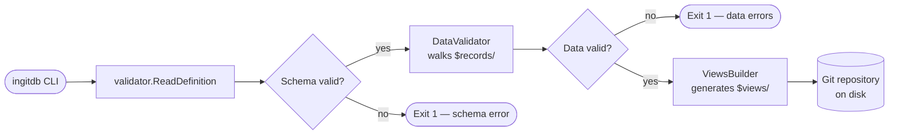

# 📘 inGitDB Documentation

inGitDB turns a Git repository into a schema-validated, queryable database where every record is
a plain YAML or JSON file. There is no server to run and no binary format to decode — the data
lives in files you can read, edit, and diff with any text editor or git client. Git itself
provides the history, branching, and merge story for free. If that sounds like the right
trade-off for your project, read on — and consider contributing.

## 📂 Index

### 👥 User docs

- [CLI](CLI.md) — command reference: flags, subcommands, exit codes
- [Configuration](configuration/README.md) — `.ingitdb.yaml` and collection config files
- [Features](features/README.md) — what inGitDB can do (and what is coming)

### 🧑‍💻 Developer docs

- [Architecture](ARCHITECTURE.md) — data model, package map, key design decisions
- [Components](components/README.md) — building blocks: Scanner, Validator, Views Builder, Watcher, and more
- [Contributing](CONTRIBUTING.md) — how to open issues and submit pull requests
- [Coding Standards](CODING_STANDARDS.md) — conventions every contributor should follow
- [Guidelines](GUIDELINES.md) — broader design and process guidelines
- [CI](CI.md) — continuous integration setup and checks

### 📦 Project docs

- [Roadmap](ROADMAP.md) — nine delivery phases from Validator to GraphQL
- [Backlog](BACKLOG.md) — concrete tasks with acceptance criteria, ordered by dependency
- [Competitors](COMPETITORS.md) — honest feature comparison with related projects

---

## 🗺️ Documentation Map

A one-line description of each document, grouped by purpose.

### 👥 User docs

| Document | What it covers |
|---|---|
| [CLI](CLI.md) | Every subcommand, flag, and exit code for the `ingitdb` binary |
| [Configuration](configuration/README.md) | Root DB config (`.ingitdb.yaml`) and per-collection schema files |
| [Features](features/README.md) | Full feature list with status (WIP / pending) and links to detail pages |
| [GitHub Direct Access](features/github-direct-access.md) | Read and write records in remote GitHub repositories without cloning |

### 🧑‍💻 Developer docs

| Document | What it covers |
|---|---|
| [Architecture](ARCHITECTURE.md) | Filesystem layout, package responsibilities, and key design decisions |
| [Components](components/README.md) | Scanner, Validator, Views Builder, Watcher, Triggers, MCP Server, and more |
| [Contributing](CONTRIBUTING.md) | Bug reports, feature suggestions, pull request workflow |
| [Coding Standards](CODING_STANDARDS.md) | Go conventions enforced in this codebase |
| [Guidelines](GUIDELINES.md) | Design and process guidelines that apply project-wide |
| [CI](CI.md) | What the CI pipeline runs and how to satisfy it locally |

### 📦 Project docs

| Document | What it covers |
|---|---|
| [Roadmap](ROADMAP.md) | Nine delivery phases from schema validation to GraphQL and migration tooling |
| [Backlog](BACKLOG.md) | Actionable tasks with acceptance criteria and implementation notes |
| [Competitors](COMPETITORS.md) | Feature matrix comparing inGitDB to related tools |

---

## ⚡ CLI Commands at a Glance

| Command | Subcommands | Status | Description |
|---|---|---|---|
| `version` | — | implemented | Print build version, commit hash, and date |
| `validate` | — | implemented | Check schema and data against `.ingitdb.yaml` |
| `read` | `record` | implemented | Read a single record by ID (local or GitHub) |
| `create` | `record` | implemented | Create a new record (local or GitHub) |
| `update` | `record` | implemented | Update fields of an existing record (local or GitHub) |
| `delete` | `record` `collection` `view` `records` | `record` implemented; others planned | Remove a record, collection, view definition, or individual records |
| `list` | `collections` `view` `subscribers` | `collections` implemented; others planned | List schema objects, optionally scoped with `--in` and `--filter-name` |
| `find` | — | planned | Search records by `--substr`, `--re`, or `--exact`; scope with `--in`, `--fields`, `--limit` |
| `truncate` | — | planned | Remove all records from a collection while keeping its schema |
| `query` | — | planned | Query and format records from a collection |
| `materialize` | — | planned | Build materialized views into `$views/` |
| `pull` | — | planned | Pull remote changes, auto-resolve generated-file conflicts, rebuild views |
| `watch` | — | planned | Stream change events to stdout as records are added, updated, or deleted |
| `serve` | — | planned | Start MCP server, HTTP API server, or file watcher (flags: `--mcp`, `--http`, `--watcher`) |
| `resolve` | — | planned | Interactive TUI for resolving merge conflicts in data files |
| `setup` | — | planned | Initialise a new database directory with a starter `.ingitdb.yaml` |
| `migrate` | — | planned | Migrate records between schema versions |

See [CLI.md](CLI.md) for the full flag reference.

---

## 🏗️ Architecture at a Glance

The diagram below shows the write path: a CLI command loads the database definition, validates
records, rebuilds materialized views, and leaves every change as a normal git commit.

The same Git repository is also exposed to AI agents via an MCP server (Phase 6), and to any
Go program through the [DALgo](https://github.com/dal-go/dalgo) abstraction layer implemented
in `pkg/dalgo2ingitdb`.

---

## 🤝 Get Involved

The best way to understand inGitDB is to point it at a directory of YAML files and run
`ingitdb validate`. From there, check the [Roadmap](ROADMAP.md) to see what is being built and
the [Backlog](BACKLOG.md) for tasks that are ready to be picked up.

To contribute:

1. Read [CONTRIBUTING.md](CONTRIBUTING.md) for the pull-request workflow.
2. Read [CODING_STANDARDS.md](CODING_STANDARDS.md) before writing any Go.
3. Open or comment on an [issue](https://github.com/ingitdb/ingitdb-cli/issues) to discuss your
   idea before investing time in a large change.

Bug reports, documentation improvements, and questions are all welcome. The project is small
enough that every contribution makes a visible difference.
