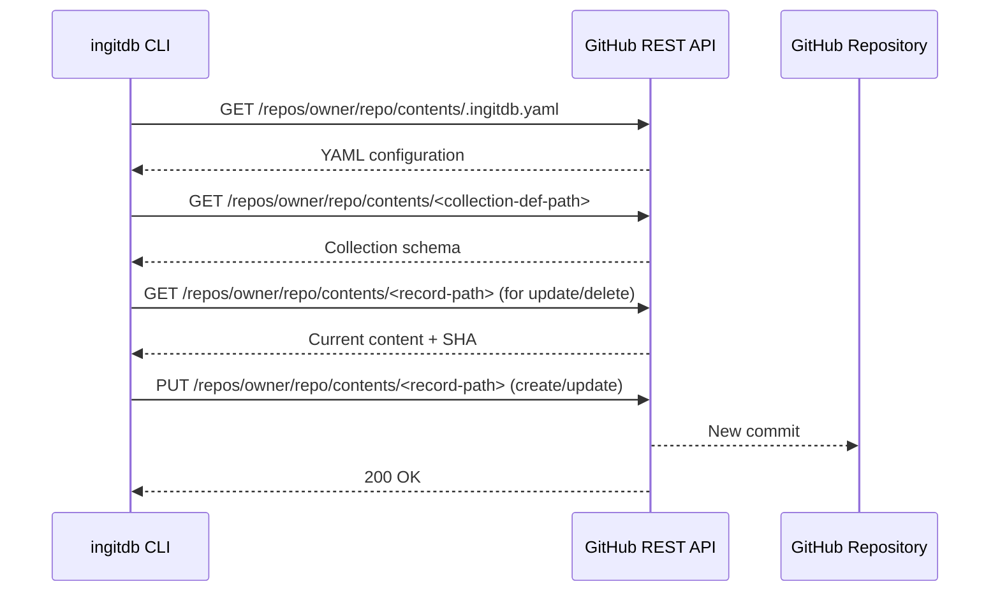

# 🐙 GitHub Direct Access

inGitDB can read and write records stored in any GitHub repository without requiring a local
clone. A single flag — `--github=owner/repo` — replaces `--path` and routes all file I/O
through the GitHub REST API. The database definition (`.ingitdb.yaml`) is resolved from the
remote repository automatically.

## 📂 Use cases

- Inspect live data in a shared team repository from CI or a local shell, with no checkout step.
- Script record updates that immediately appear as commits in the target repository.
- Give AI agents or automation tools write access to a data repository without provisioning
  SSH keys or deploying any server.
- Read-only dashboards that pull from a canonical data repository on every run.

---

## 🐙 The `--github` flag format

```
--github=owner/repo
--github=owner/repo@ref
```

| Component | Description |
|-----------|-------------|
| `owner` | GitHub organisation name or personal account name. |
| `repo` | Repository name. |
| `@ref` | Optional git reference: branch name, tag name, or full commit SHA. When omitted the repository's default branch is used. |

**Examples:**

```shell
--github=ingitdb/ingitdb-cli          # default branch
--github=ingitdb/ingitdb-cli@main     # branch
--github=ingitdb/ingitdb-cli@v1.2.0   # tag
--github=ingitdb/ingitdb-cli@a3f9c12  # commit SHA
```

---

## 📂 Authentication

### 🔹 When a token is required

| Operation | Public repo | Private repo |
|-----------|-------------|--------------|
| `read record` | No token needed | Token required |
| `list collections` | No token needed | Token required |
| `create record` | Token required | Token required |
| `update record` | Token required | Token required |
| `delete record` | Token required | Token required |

The GitHub REST API allows unauthenticated reads of public repositories at 60 requests per
hour. All write operations use the Contents API endpoint (`PUT`/`DELETE`), which requires a
token regardless of repository visibility.

### 🔹 How to supply a token

**Environment variable (recommended):**

```shell
export GITHUB_TOKEN=ghp_...
ingitdb read record --github=owner/repo --id=countries/ie
```

**Inline flag:**

```shell
ingitdb read record --github=owner/repo --token=ghp_... --id=countries/ie
```

When both are set, `--token` takes precedence over `GITHUB_TOKEN`.

### 🐙 Creating a GitHub Personal Access Token

1. Go to **GitHub → Settings → Developer settings → Personal access tokens → Fine-grained tokens**.
2. Click **Generate new token**.
3. Set an expiration and choose the target repository under **Repository access**.
4. Under **Permissions → Repository permissions**, enable:
   - **Contents** → **Read and write** (for write operations)
   - **Contents** → **Read-only** (for private read-only access)
5. Copy the generated token and export it as `GITHUB_TOKEN`.

Classic tokens with the `repo` scope also work but grant broader access than fine-grained tokens.

---

## 🖥️ Supported commands

| Command | `--github` | `--token` | Auth required? |
|---------|-----------|-----------|----------------|
| `read record` | yes | optional | Only for private repos |
| `list collections` | yes | optional | Only for private repos |
| `create record` | yes | required | Always |
| `update record` | yes | required | Always |
| `delete record` | yes | required | Always |

`--path` and `--github` are mutually exclusive on all commands.

---

## 📂 Read operations

### 🔹 read record`

```shell
ingitdb read record --github=owner/repo[@ref] --id=collection/key [--format=yaml|json] [--token=TOKEN]
```

| Flag | Required | Description |
|------|----------|-------------|
| `--github` | yes | Repository as `owner/repo[@ref]`. |
| `--id` | yes | Record ID as `collection/path/key` (e.g. `countries/ie`). |
| `--format` | no | Output format: `yaml` (default) or `json`. |
| `--token` | no | GitHub token; falls back to `GITHUB_TOKEN` env var. |

**Examples:**

```shell
# 📘 Read a record from a public repository (YAML output)
ingitdb read record --github=ingitdb/ingitdb-cli --id=todo.tags/active

# 📘 Read from a pinned branch, output as JSON
ingitdb read record --github=myorg/mydb@production --id=countries/ie --format=json

# 📘 Read from a private repository
export GITHUB_TOKEN=ghp_...
ingitdb read record --github=myorg/private-db --id=users/alice
```

**Output (YAML):**

```yaml
title: Active
```

**Output (JSON):**

```json
{
  "title": "Active"
}
```

### ⚙️ list collections`

```shell
ingitdb list collections --github=owner/repo[@ref] [--token=TOKEN]
```

| Flag | Required | Description |
|------|----------|-------------|
| `--github` | yes | Repository as `owner/repo[@ref]`. |
| `--token` | no | GitHub token; falls back to `GITHUB_TOKEN` env var. |

The command reads `.ingitdb.yaml` from the repository root and prints each configured collection ID
on its own line. `rootCollections` entries are explicit (one ID → one directory), so listing does
not require extra GitHub directory listing calls and returns faster.

**Example:**

```shell
ingitdb list collections --github=ingitdb/ingitdb-cli
```

**Output:**

```
countries
todo.tags
todo.tasks
```

---

## 📂 Write operations

Each write command reads the `.ingitdb.yaml` configuration and the target collection's schema
from the remote repository, then calls the GitHub Contents API to create, update, or delete the
record file. Every successful write lands as a single commit on the target branch (the `@ref`
specified in `--github`, or the repository's default branch).

### 🔹 create record`

Creates a new record. Fails if a record with the same key already exists.

```shell
ingitdb create record --github=owner/repo[@ref] --id=collection/key --data=YAML [--token=TOKEN]
```

| Flag | Required | Description |
|------|----------|-------------|
| `--github` | yes | Repository as `owner/repo[@ref]`. |
| `--id` | yes | Record ID as `collection/path/key`. |
| `--data` | yes | Record fields as YAML or JSON. |
| `--token` | yes* | GitHub token; falls back to `GITHUB_TOKEN` env var. |

*Required for all write operations.

**Examples:**

```shell
export GITHUB_TOKEN=ghp_...

# 📘 Create a simple record
ingitdb create record --github=myorg/mydb --id=countries/ie --data='{name: Ireland}'

# 📘 Create a record with nested fields
ingitdb create record --github=myorg/mydb --id=countries/ie \
  --data='{name: Ireland, capital: Dublin, population: 5000000}'

# 🔁 Target a specific branch
ingitdb create record --github=myorg/mydb@staging --id=countries/ie --data='{name: Ireland}'
```

### 🔹 update record`

Updates fields of an existing record. Uses patch semantics: only the fields supplied in `--set`
are changed; all other fields in the record are preserved.

```shell
ingitdb update record --github=owner/repo[@ref] --id=collection/key --set=YAML [--token=TOKEN]
```

| Flag | Required | Description |
|------|----------|-------------|
| `--github` | yes | Repository as `owner/repo[@ref]`. |
| `--id` | yes | Record ID as `collection/path/key`. |
| `--set` | yes | Fields to patch as YAML or JSON. |
| `--token` | yes* | GitHub token; falls back to `GITHUB_TOKEN` env var. |

**Examples:**

```shell
export GITHUB_TOKEN=ghp_...

# 📘 Add or overwrite a single field
ingitdb update record --github=myorg/mydb --id=countries/ie --set='{capital: Dublin}'

# 📘 Patch multiple fields at once
ingitdb update record --github=myorg/mydb --id=countries/ie \
  --set='{capital: Dublin, population: 5100000}'
```

### 🔹 delete record`

Deletes a record. For `SingleRecord` collections, the record file is removed. For
`MapOfIDRecords` collections, the key is removed from the shared map file.

```shell
ingitdb delete record --github=owner/repo[@ref] --id=collection/key [--token=TOKEN]
```

| Flag | Required | Description |
|------|----------|-------------|
| `--github` | yes | Repository as `owner/repo[@ref]`. |
| `--id` | yes | Record ID as `collection/path/key`. |
| `--token` | yes* | GitHub token; falls back to `GITHUB_TOKEN` env var. |

**Example:**

```shell
export GITHUB_TOKEN=ghp_...
ingitdb delete record --github=myorg/mydb --id=countries/ie
```

---

## 📂 How writes work



Each write is a single API call that creates one commit. There are no multi-file transactions:
if you need to write several records atomically, use a local clone with `--path` and commit the
changes yourself.

---

## 📂 Rate limits

| Token status | Limit |
|---|---|
| Unauthenticated | 60 requests / hour per IP |
| Authenticated (any token) | 5,000 requests / hour |
| GitHub Actions `GITHUB_TOKEN` | 1,000 requests / hour |

Each `read record` or `create record` call makes 2–3 API requests (config resolution + schema
fetch + record read/write). Budget accordingly for scripts that loop over many records.

When the rate limit is exceeded the CLI returns an error:

```
error: github api rate limit exceeded while reading ".ingitdb.yaml": ...
```

Supply a token to raise the limit from 60 to 5,000 requests per hour.

---

## 📂 Limitations

- **No read-after-write consistency within a run.** There is no local cache; each `Get` call
  fetches from GitHub independently. A record written by one command is visible to subsequent
  commands only if the remote is consistent (which it is for single-branch writes).
- **One commit per write.** Each `create`, `update`, or `delete` call creates exactly one
  commit. Bulk operations are not supported through the GitHub adapter; use a local clone for
  that.
- **No optimistic concurrency.** Two concurrent writers targeting the same record file will
  produce a conflict on the second write (GitHub rejects updates with a stale SHA). The CLI
  returns the API error; retry the operation.
- **Branch pinning.** The `@ref` in `--github` must name a branch for writes. Specifying a tag
  or a commit SHA on a write operation will be rejected by GitHub (tags and SHAs are immutable).
- **`--path` and `--github` are mutually exclusive.** Combining them returns an error.
- **Only `SingleRecord` and `MapOfIDRecords` collection types are supported** for reads and
  writes. `ListRecord` collections are not yet implemented.

---

## 📂 See also

- [CLI reference](../CLI.md) — full flag reference for all commands
- [DALGO2GHINGITDB adapter](../DALGO2GHINGITDB.md) — Go package documentation for the
  GitHub DALgo adapter used under the hood
- [Transactions](transactions.md) — local read/write transaction model
